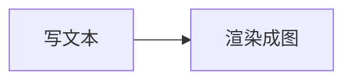
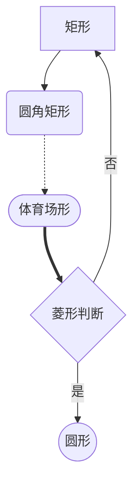
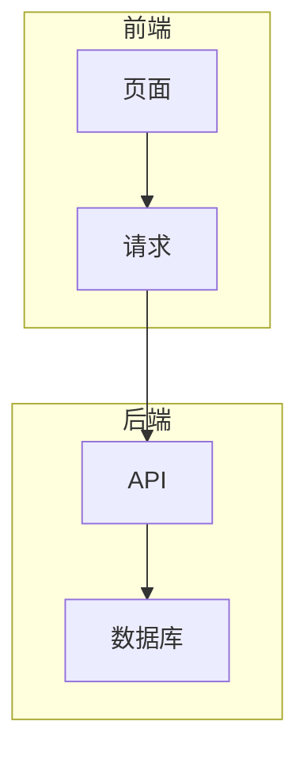
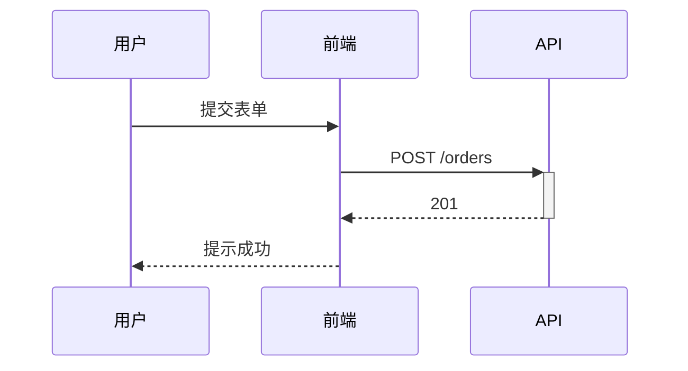
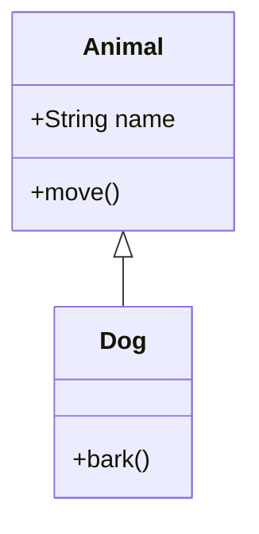
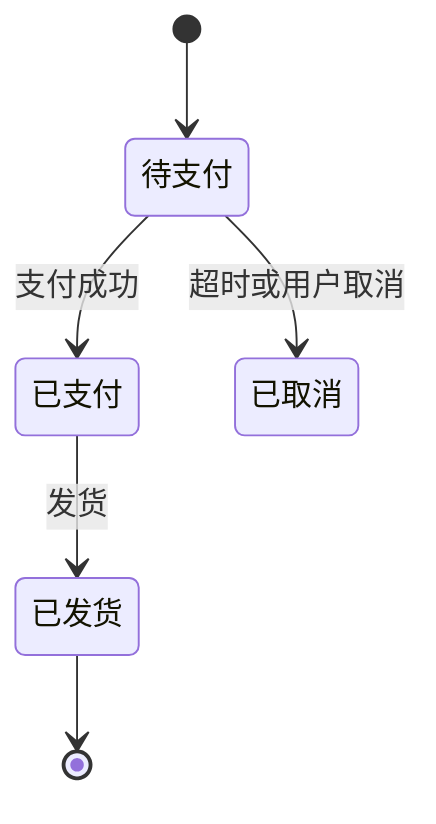
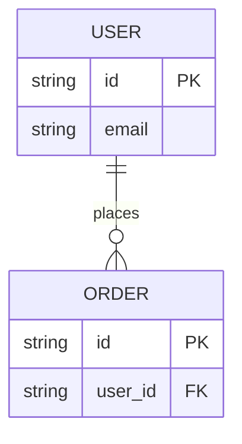
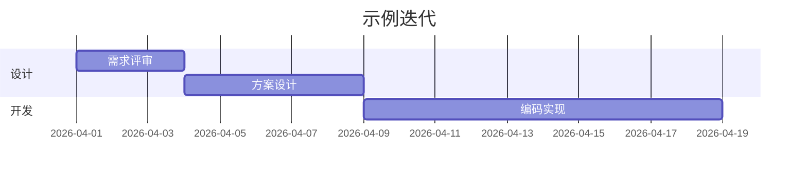
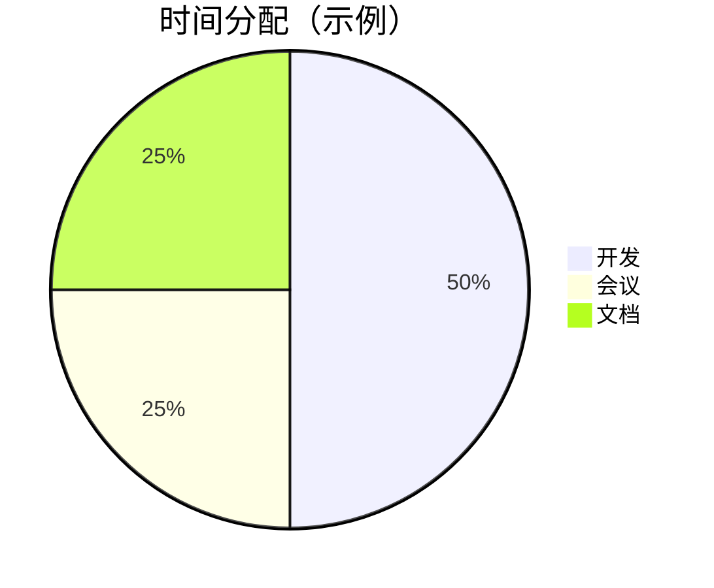
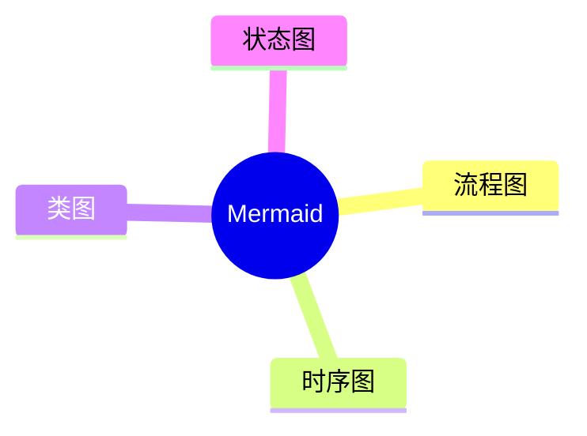

# Mermaid 语法入门

[Mermaid](https://mermaid.js.org/) 是一种用**纯文本**描述图表的标记语言。把图和文档一起放进 Git、在 Markdown 里直接写、评审时还能看 diff，是它最常见的使用动机。

本文按「能照着写」的目标整理常用语法；更完整的说明以[官方文档](https://mermaid.js.org/intro/)为准。

## 在 Markdown 里怎么用

与 GitHub、多数编辑器一致，**` ```mermaid `** 代码块通常**只渲染成图**，不重复展示源码：



本博客在需要「对照源码」时，另约定一种围栏语言 **` ```mermaid-doc `**：会先显示与 `mermaid` 相同的高亮源码，再在下方显示渲染结果。下文语法示例均使用 `mermaid-doc`。

在线试写可使用 [Mermaid Live Editor](https://mermaid.live/)。

---

## 1. 流程图（flowchart）

### 方向

| 关键字 | 含义 |
|--------|------|
| `TB` / `TD` | 自上而下 |
| `BT` | 自下而上 |
| `LR` | 从左到右 |
| `RL` | 从右到左 |

### 节点形状与连线



### 子图（subgraph）



---

## 2. 时序图（sequenceDiagram）

描述参与者之间**按时间**的交互：



- `participant`：声明参与者。  
- `->` / `-->`：实线 / 虚线消息；`>>` 为异步风格箭头（视渲染版本略有差异）。  
- `+` / `-`：可表示激活条（调用期间）。

---

## 3. 类图（classDiagram）

适合表达面向对象结构：



关系符号很多（关联、聚合、组合等），需要时查[类图语法页](https://mermaid.js.org/syntax/classDiagram.html)。

---

## 4. 状态图（stateDiagram-v2）

适合订单、工单等**状态迁移**：



---

## 5. ER 图（erDiagram）

快速画表之间的实体关系：



---

## 6. 甘特图（gantt）

项目排期、里程碑：



---

## 7. 饼图（pie）



---

## 8. 思维导图（mindmap）

较新的 Mermaid 版本支持（若本地不渲染，多半是版本或环境未开启）：



---

## 实用建议

1. **节点 ID** 建议用英文、数字、下划线，显示文字放在 `[]`、`()` 等括号内。  
2. **特殊字符**：标签内容可用英文双引号包裹。  
3. **版本差异**：新图表类型在旧环境可能报错；以你使用的 Mermaid 版本为准。  
4. **调试**：语法错误时渲染器会提示；先在 Live Editor 验证再贴进长文。  

## 速查表

| 类型 | 关键字 | 典型场景 |
|------|--------|----------|
| 流程图 | `flowchart` | 分支、业务流程 |
| 时序图 | `sequenceDiagram` | 调用链、前后端协作 |
| 类图 | `classDiagram` | 领域模型 |
| 状态图 | `stateDiagram-v2` | 生命周期 |
| ER 图 | `erDiagram` | 表关系草图 |
| 甘特图 | `gantt` | 排期 |
| 饼图 | `pie` | 简单占比 |

---

## 参考链接

- [Mermaid 官方文档](https://mermaid.js.org/)  
- [Mermaid Live Editor](https://mermaid.live/)  
