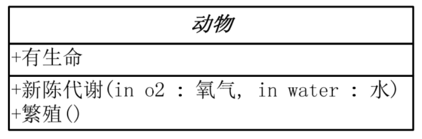
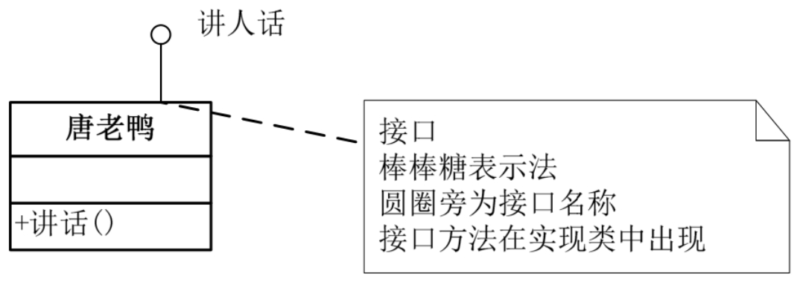
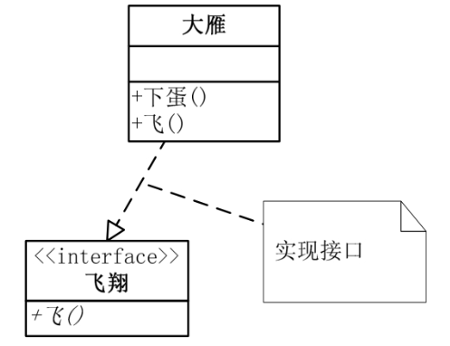
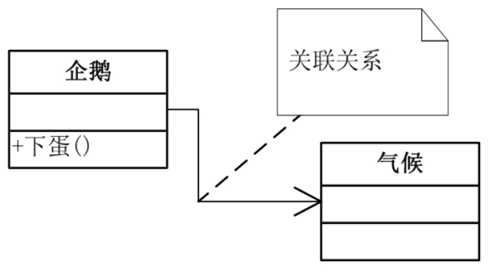
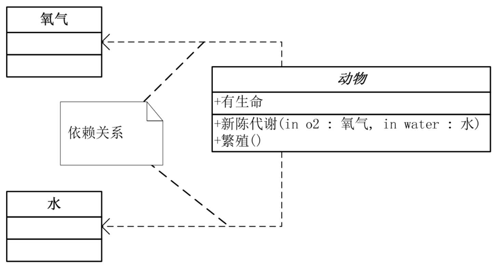

# UML类图

书中截图：


## 基本组成

### 类



这个矩形框代表一个类（Class）。

- 第一层是类的名称，抽象类用斜体表示。
- 第二层是类的属性。
- 第三层是类的方法，`+`表示public，`-`表示private，`#`表示protected。


### 接口


这个矩形代表一个接口（interface），顶端有`<<interface>>`。

- 第一层是接口名称。
- 第二层是接口方法。

另一种表示方法：俗称**棒棒糖表示法**。




## 基本关系

### 继承关系


用**==空心三角形+实现表示继承==**关系。


### 实现接口



用**==空心三角形+虚线表示实现接口==**。


### 关联关系

当一个类”知道“另一个类时，可以用**关联（association）**。**==关联关系用实线箭头==**来表示。



```java
public class Penguin extends Birds {
    private Climate climate;
}
```


### 聚合关系

每只大雁都是属于一个雁群，一个雁群可以包含多只大雁，所以它们满足聚合（Aggregation）关系。**聚合表示一种弱的“拥有”关系，体现的是A对象可以包含B对象，但B对象不是A对象的一部分**。用**==空心棱形+实线箭头表示聚合==**关系。


```java
public class WideGooseAggregate {
    private WideGoose[] arrayWideGoose;
}
```


### 组合关系

合成（Composition，也有翻译成‘组合’的）是一种**强的‘拥有’关系**，体现了严格的部分和整体的关系，部分和整体的生命周期一样。合成关系的连线两端还有一个数字‘1’和数字‘2’，这被称为基数。表明这一端的类可以有几个实例，很显然，一个鸟应该有两只翅膀。如果一个类可能有无数个实例，则就用‘n’来表示。关联关系、聚合关系也可以有基数的。用**==实心棱形+实线箭头表示组合==**关系。


```java
public class Bird {
    private Wing wing;
    public Bird() {
        //在鸟类实例初始化时就实例化翅膀类
        wing = new Wing();
    }
}
```


### 依赖关系

动物依赖于氧气和水。他们之间是**==依赖关系（Dependency），用虚线箭头==**来表示。



```java
abstract class Animal {
    public Metabolism (Oxygen oxygen,Water water) {
 
    }
}
```


### 补充文档

:information_source:这里贴一个知乎的帖子：https://zhuanlan.zhihu.com/p/359672087


